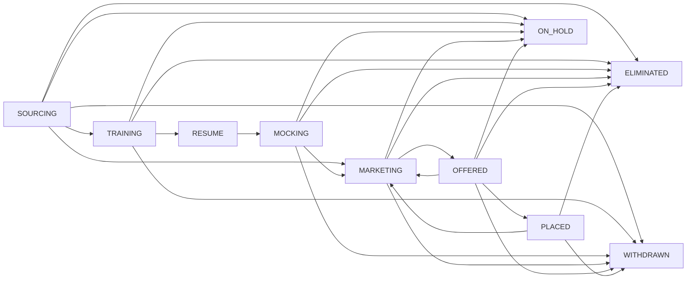

# Candidate Lifecycle Redesign (Single State Machine + Tracking Timeline)

## 目标与范围

### 目标
- 用单一主状态 `stage` + 子状态 `subStatus` 替代双状态机，消除冲突。
- 支持业务：暂停、退出、淘汰、复活、直推市场。
- 不引入审批机制，所有动作由 recruiter 直接触发。
- 以事件表驱动“快递 tracking 风格”的候选人时间线。

### 非目标
- 不做权限/认证体系（保持现状）。
- 不强绑定 Vendor Engagement/Opportunity 与 OFFERED/PLACED。

## 产品决策（已确认）
- 允许 ELIMINATED/WITHDRAWN 复活，不需要审批，但必须填写 `reactivateReason`。
- DIRECT_MARKETING 由 recruiter 自主触发，不需要审批，但需要资料完整度校验。
- OFFERED/PLACED 不强制绑定 Vendor Engagement/Opportunity。
- 批次分配允许跳过 screening。
- Batch End 仅推进 TRAINING 阶段的候选人。

## 状态模型

### 主状态 (CandidateStage)
- `SOURCING` 招募/筛选
- `TRAINING` 培训进行中
- `RESUME` 简历准备阶段
- `MOCKING` 培训后 Mock 阶段（Theory -> Real）
- `MARKETING` 营销期
- `OFFERED` Offer 中
- `PLACED` 已入职
- `ELIMINATED` 淘汰
- `WITHDRAWN` 退出
- `ON_HOLD` 暂停

### Stage 含义与前置条件

| Stage | 含义 | 进入前置条件 |
| --- | --- | --- |
| SOURCING | 招募/筛选阶段（录入、联系、筛选） | 默认阶段，无硬性前置条件 |
| TRAINING | 已进入培训批次 | `batch` 非空（允许跳过筛选） |
| RESUME | 简历准备阶段 | Batch End 事件驱动（仅 TRAINING） |
| MOCKING | 培训后 Mock 阶段 | `subStatus=RESUME_READY` |
| MARKETING | 营销期 | 直推：`subStatus=DIRECT_MARKETING_READY` + 完整度校验；Mock：`MOCK_REAL_PASSED` |
| OFFERED | Offer 阶段 | `offerType` 必填（W2/C2C） |
| PLACED | 成功入职 | `startDate` 必填 |
| ELIMINATED | 淘汰关闭 | `closeReason` 必填 |
| WITHDRAWN | 候选人退出 | `withdrawReason` 必填 |
| ON_HOLD | 暂停跟进 | `holdReason` + `nextFollowUpAt` 必填 |

### 子状态 (CandidateSubStatus)
- SOURCING: `SOURCED`, `CONTACTED`, `SCREENING_SCHEDULED`, `SCREENING_PASSED`, `SCREENING_FAILED`, `TRAINING_CONTRACT_SENT`, `TRAINING_CONTRACT_SIGNED`, `BATCH_ASSIGNED`, `DIRECT_MARKETING_READY`
- TRAINING: `IN_TRAINING`
- RESUME: `RESUME_PREPARING`, `RESUME_READY`
- MOCKING: `MOCK_THEORY_READY`, `MOCK_THEORY_SCHEDULED`, `MOCK_THEORY_PASSED`, `MOCK_THEORY_FAILED`, `MOCK_REAL_SCHEDULED`, `MOCK_REAL_PASSED`, `MOCK_REAL_FAILED`
- MARKETING: `MARKETING_ACTIVE`（占位，不作为子阶段）
- OFFERED: `OFFER_PENDING`, `OFFER_ACCEPTED`, `OFFER_DECLINED`
- ON_HOLD: `WAITING_DOCS`, `PERSONAL_PAUSE`, `VISA_ISSUE`, `OTHER`
- PLACED: `PLACED_CONFIRMED`
- ELIMINATED: `CLOSED`
- WITHDRAWN: `SELF_WITHDRAWN`

### 迁移与校验规则

| From | To | 必填/校验 |
| --- | --- | --- |
| SOURCING | TRAINING | `batch` 非空 |
| SOURCING | MARKETING | `subStatus=DIRECT_MARKETING_READY` + 完整度校验 |
| TRAINING | RESUME | Batch End 事件驱动 |
| RESUME | MOCKING | `subStatus=RESUME_READY` |
| MOCKING | MARKETING | `subStatus=MOCK_REAL_PASSED` |
| MARKETING | OFFERED | `offerType` 必填 |
| OFFERED | PLACED | `startDate` 必填 |
| 任意 | ELIMINATED | 必须 `closeReason` |
| 任意 | WITHDRAWN | 必须 `withdrawReason` |
| 非终态阶段 | ON_HOLD | 必须 `holdReason` + `nextFollowUpAt` |
| ON_HOLD | lastActiveStage | 必须存在 `lastActiveStage` |
| ELIMINATED/WITHDRAWN | 非终态阶段 | 必须 `reactivateReason` |

注: 非终态阶段 = `SOURCING`, `TRAINING`, `RESUME`, `MOCKING`, `MARKETING`, `OFFERED`。

### 反向/异常迁移补充
- OFFERED -> MARKETING: 允许（Offer declined 后回到营销），必须 `reason`。
- PLACED -> MARKETING: 允许（合同结束重新营销），必须 `reason`。
- ON_HOLD -> 其它阶段: 若非 `lastActiveStage` 必须 `reason`。

### 完整迁移图（Mermaid）

## 事件驱动规则（关键流程）

### Screening Mock
- 创建 Screening Mock: `SCREENING_SCHEDULED`
- 完成 Screening Mock: Strong Hire/Hire -> `SCREENING_PASSED`，否则 `SCREENING_FAILED`

### Batch
- 分配 batch: `BATCH_ASSIGNED`
- Batch Start: batch 内候选人 -> `TRAINING`
- Batch End: 仅 TRAINING 候选人 -> `RESUME`，subStatus -> `RESUME_PREPARING`

### Resume
- 进入 RESUME: 默认 `RESUME_PREPARING`
- 简历完成: `RESUME_READY`
- 进入 MOCKING 需要 `RESUME_READY`

### Mocking
- 创建 Theory Mock -> `MOCK_THEORY_SCHEDULED`
- 完成 Theory Mock -> `MOCK_THEORY_PASSED` / `MOCK_THEORY_FAILED`
- 创建 Real Mock 仅允许在 `MOCK_THEORY_PASSED`
- 完成 Real Mock: Pass -> `MOCK_REAL_PASSED` + 自动进入 MARKETING

### Marketing / Engagements
- Vendor Engagement/Opportunity 事件驱动 Timeline（按 engagement/opportunity 关联）
- 不再使用 INTERVIEWING stage

## 手动覆盖
支持人工变更 stage / subStatus（需 `reason`），但必须通过合法校验规则。
