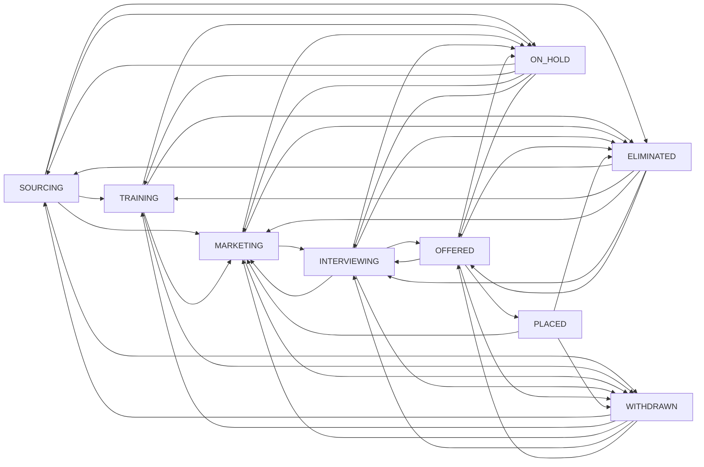

# Candidate Lifecycle Redesign (Single State Machine + Tracking Timeline)

## 目标与范围

### 目标
- 用单一主状态 `stage` + 子状态 `subStatus` 替代双状态机，消除冲突。
- 支持业务：暂停、退出、淘汰、复活、直推市场。
- 不引入审批机制，所有动作由 recruiter 直接触发。
- 以事件表驱动“快递 tracking 风格”的候选人时间线。

### 非目标
- 不做权限/认证体系（保持现状）。
- 不强绑定 Submission 与 OFFERED/PLACED。

## 产品决策（已确认）
- 允许 ELIMINATED/WITHDRAWN 复活，不需要审批，但必须填写 `reactivateReason`。
- DIRECT_MARKETING 由 recruiter 自主触发，不需要审批，但需要资料完整度校验。
- OFFERED/PLACED 不强制绑定 Submission。

## 现状问题
- `lifecycleStage` + `recruitmentStatus` 双状态并存，容易产生矛盾。
- 创建候选人即写入 `CONTRACT_SIGNED` 事件，语义不匹配。
- 营销/面试/offer 流程散落在 Submission 和 Timeline 中，主流程不清晰。

## 状态模型

### 主状态 (CandidateStage)
- `SOURCING` 招募筛选
- `TRAINING` 培训
- `MARKETING` 营销准备
- `INTERVIEWING` 面试中
- `OFFERED` Offer 中
- `PLACED` 已入职
- `ELIMINATED` 淘汰
- `WITHDRAWN` 退出
- `ON_HOLD` 暂停

### 子状态 (CandidateSubStatus)
- SOURCING: `SOURCED`, `CONTACTED`, `SCREENING_SCHEDULED`, `SCREENING_PASSED`, `SCREENING_FAILED`, `DIRECT_MARKETING_READY`
- TRAINING: `IN_TRAINING`, `HOMEWORK_PENDING`, `MOCK_IN_PROGRESS`, `TRAINING_COMPLETED`
- MARKETING: `RESUME_READY`, `PROFILE_PACKAGED`, `VENDOR_OUTREACH`, `SUBMITTED`
- INTERVIEWING: `VENDOR_SCREEN`, `CLIENT_ROUND_1`, `CLIENT_ROUND_2`, `CLIENT_ROUND_3_PLUS`
- OFFERED: `OFFER_PENDING`, `OFFER_ACCEPTED`, `OFFER_DECLINED`
- ON_HOLD: `WAITING_DOCS`, `PERSONAL_PAUSE`, `VISA_ISSUE`, `OTHER`
- PLACED: `PLACED_CONFIRMED`
- ELIMINATED: `CLOSED`
- WITHDRAWN: `SELF_WITHDRAWN`

### 迁移与校验规则

| From | To | 必填/校验 |
| --- | --- | --- |
| SOURCING | TRAINING | `subStatus=SCREENING_PASSED` 且 `batch` 非空 |
| SOURCING | MARKETING | `subStatus=DIRECT_MARKETING_READY` 且资料完整度校验 |
| TRAINING | MARKETING | `resumeReady=true` |
| MARKETING | INTERVIEWING | 存在 Submission 事件即可（不强制绑定） |
| INTERVIEWING | OFFERED | 无强制绑定 Submission |
| OFFERED | PLACED | `startDate` 必填 |
| 任意 | ELIMINATED | 必须 `closeReason` |
| 任意 | WITHDRAWN | 必须 `withdrawReason` |
| 非终态阶段 | ON_HOLD | 必须 `holdReason` + `nextFollowUpAt` |
| ON_HOLD | lastActiveStage | 必须存在 `lastActiveStage` |
| ELIMINATED/WITHDRAWN | 非终态阶段 | 必须 `reactivateReason` |

注: 非终态阶段 = `SOURCING`, `TRAINING`, `MARKETING`, `INTERVIEWING`, `OFFERED`。

### 反向/异常迁移补充
- INTERVIEWING -> MARKETING: 允许（面试失败后回到营销），必须 `reason`。
- OFFERED -> INTERVIEWING: 允许（Offer declined 后继续面试），必须 `reason`。
- PLACED -> MARKETING: 允许（入职后离职重新营销），必须 `reason`。
- PLACED -> WITHDRAWN/ELIMINATED: 允许（正式关闭档案），必须 `withdrawReason/closeReason`。
- ON_HOLD -> lastActiveStage: 默认只回到 `lastActiveStage`。如需跳阶段，必须显式指定目标阶段并提供 `reason`。

### 完整迁移图（Mermaid）


### 资料完整度校验（DIRECT_MARKETING）
- `name` 非空
- `email` 或 `phone` 至少一个
- `workAuth` 非空
- `techTags` 非空
- `city/state` 至少一个
- `resumeReady=true`

## 数据模型（Backend）

### Candidate 新增字段
- `stage` (enum CandidateStage)
- `subStatus` (string/enum)
- `lastActiveStage` (enum)
- `stageUpdatedAt` (timestamp)
- `holdReason` (string)
- `nextFollowUpAt` (timestamp)
- `closeReason` (enum CloseReason)
- `closeReasonNote` (string, optional)
- `withdrawReason` (string)
- `reactivateReason` (string)
- `offerDate` (date)
- `startDate` (date)

### TimelineEvent 事件表（基于现有表扩展）
- `eventType` (enum) 扩展：`CANDIDATE_CREATED`, `STAGE_CHANGED`, `SUBSTATUS_CHANGED`, `ON_HOLD`, `ELIMINATED`, `WITHDRAWN`, `REACTIVATED`, `OFFERED`, `PLACED`, `NOTE`
- `title` / `description`
- `fromStage` / `toStage` / `subStatus`
- `createdBy`
- `eventDate` (事件发生时间，可选由用户填，默认 now)
- `metaJson` (TEXT, JSON 字符串，可选)

### DTO/Request 变更（建议）
- `TransitionRequest` 新增字段：`toStage`, `toSubStatus`, `closeReason`, `withdrawReason`, `holdReason`, `nextFollowUpAt`, `reactivateReason`, `offerDate`, `startDate`, `actorId`。
- `TimelineEventRequest` 新增字段：`eventType`, `title`, `description`, `subStatus`, `metaJson`, `actorId`。
注: 如果需要兼容旧字段，可临时支持 `changedById/createdById` 作为别名。

## Timeline Tracking 设计

### 目标
- 时间线完全基于事件表渲染，避免前端从 Candidate/Submissions 拼接。
- 关键动作必须写事件，确保数据一致性。

### 事件来源
- 系统事件：创建、状态变更、暂停、淘汰、退出、复活、offer/placed。
- 业务事件：vendor submit、client round、offer 反馈等（可由 Submission 派生写入）。
- 人工事件：沟通记录、备注。

### 事件生成规则
- `CandidateService.create()` 写 `CANDIDATE_CREATED`。
- `transition()` 写 `STAGE_CHANGED` / `ON_HOLD` / `ELIMINATED` / `WITHDRAWN` / `REACTIVATED`。
- `Submission` 状态变更可补充 `CLIENT_ROUND_*` 或 `OFFERED` 事件（弱关联）。
- 事件表按 `eventDate desc` 查询并返回。

### 时间字段语义
- `eventDate`: 事件发生时间，允许手动指定历史时间（用于回填）。未指定则后端写当前时间。
- `stageUpdatedAt`: 主状态变更时间，由后端自动写入。
- `offerDate`: Offer 确认或发出的日期，用于报表和筛选。
- `startDate`: 入职日期，用于 placed 统计与后续分析。
- `offerDate/startDate` 建议同时写入 timeline `metaJson`，保留审计记录。

### UI 展示建议
- 候选人详情页固定展示 Timeline，按时间倒序。
- 关键事件（Stage 变化、Offer、Placed）高亮。
- 支持创建人工事件（备注/沟通）。

## API 设计（建议）

### POST /api/candidates/{id}/transition
```json
{
  "toStage": "MARKETING",
  "toSubStatus": "RESUME_READY",
  "actorId": 1,
  "holdReason": null,
  "nextFollowUpAt": null,
  "closeReason": null,
  "withdrawReason": null,
  "reactivateReason": null,
  "offerDate": null,
  "startDate": null,
  "reason": "Direct marketing"
}
```
说明: `reason` 是通用描述，淘汰/退出/暂停/复活建议使用专用字段（`closeReason`/`withdrawReason`/`holdReason`/`reactivateReason`）。

### GET /api/candidates/{id}/timeline
返回事件数组，按 `eventDate desc`。

### POST /api/candidates/{id}/timeline
```json
{
  "eventType": "NOTE",
  "title": "WeChat follow-up",
  "description": "Candidate requested reschedule",
  "actorId": 1,
  "metaJson": "{\"channel\":\"wechat\"}"
}
```

## 兼容与迁移

### 旧字段映射（初始回填）
- `lifecycleStage=PLACED` -> `stage=PLACED`, `subStatus=PLACED_CONFIRMED`
- `lifecycleStage=ELIMINATED` -> `stage=ELIMINATED`, `subStatus=CLOSED`
- `lifecycleStage=MARKET_READY` -> `stage=MARKETING`, `subStatus=RESUME_READY`
- `lifecycleStage=TRAINING` -> `stage=TRAINING`, `subStatus=IN_TRAINING`
- `lifecycleStage=RECRUITMENT` + `recruitmentStatus=DIRECT_MARKETING` -> `stage=MARKETING`, `subStatus=DIRECT_MARKETING_READY`
- `lifecycleStage=RECRUITMENT` + `recruitmentStatus=SCREENING_PASSED` -> `stage=TRAINING`, `subStatus=IN_TRAINING`
- 其余 `recruitmentStatus` -> `stage=SOURCING`, `subStatus` 同名

### 迁移策略
- Phase 1: 新增字段并双写（旧字段继续保留）。
- Phase 2: 读路径切换到 `stage/subStatus`，旧字段仅回填。
- Phase 3: 业务稳定后清理旧字段（可选）。

## 实现步骤（建议顺序）

### Backend
1. 新增 `CandidateStage` 枚举与字段（Candidate 实体）。
2. 扩展 `TimelineEvent` 字段（`subStatus`, `metaJson`）。
3. 更新 `TransitionRequest` 与 `TimelineEventRequest` DTO。
4. 在 `CandidateService.create()` 中写入 `CANDIDATE_CREATED`。
5. 在 `CandidateService.transition()` 中实现状态校验 + 事件写入。
6. 引入 `mapLegacyToStage()` 在读取时兜底回填。
7. 添加 `findByStage` 等 repository 方法。
8. 更新现有 API 的字段映射与返回。
9. 选择性添加测试（DataJpaTest/WebMvcTest）。

### Frontend
1. `types` 增加 `CandidateStage`, `CandidateSubStatus`。
2. `api.ts` 更新 Candidate 类型与 transition payload。
3. 候选人列表/详情改用 `stage/subStatus` 展示。
4. 增加“状态变更”面板（支持 reason/日期）。
5. 增加 Tracking Timeline 组件（支持新增事件）。

## Seed Data 与验证
- 当前无真实数据，开发期使用 H2 与 fake data 验证。
- 保留现有 `scripts/seed-data.sh` 不变。
- 使用新脚本 `scripts/seed-data-timeline.sh` 生成候选人与 timeline 事件。
- 验证时先 `GET /api/candidates` 获取 id，再执行 transition 或 timeline 操作。

## Milestones & 验证计划（基于 seed data）

### Milestone 1: 数据模型与枚举落地
Tasks:
- 新增 CandidateStage/SubStatus 与 Candidate 字段。
- TimelineEvent 扩展 `subStatus` 与 `metaJson`。
- 双写策略和 `mapLegacyToStage()`。

验证计划:
1. 启动 backend 后运行 `./scripts/seed-data.sh`。
2. `GET /api/candidates`，确认每个候选人都有 `stage/subStatus`。
3. 检查 Sara/Zack/Emma/Tom 映射是否符合规则。

### Milestone 2: Transition 服务与校验
Tasks:
- 完成 `transition()` 校验逻辑。
- 自动写入事件：`STAGE_CHANGED`, `ON_HOLD`, `ELIMINATED`, `REACTIVATED`。

验证计划:
1. Emma (无 batch) 走 `SOURCING -> TRAINING` 应返回 400。
2. Sara (有 batch) 走 `TRAINING -> MARKETING`，`resumeReady=false` 应返回 400。
3. Tom (ELIMINATED) 复活到 SOURCING，必须携带 `reactivateReason`。

### Milestone 3: Timeline API + Tracking 事件
Tasks:
- `GET /api/candidates/{id}/timeline` 返回事件列表。
- `POST /api/candidates/{id}/timeline` 支持人工事件。
- 关键动作自动写事件。

验证计划:
1. 对 Sara/Tom 执行状态变更，timeline 中有对应事件。
2. 为 Emma 添加人工事件，GET timeline 能看到新事件。
3. 确认排序为 `eventDate desc`。

### Milestone 4: 前端状态与 Timeline UI
Tasks:
- 更新 types/api。
- 列表/详情展示 `stage/subStatus`。
- 新增状态变更面板与 Timeline 组件。

验证计划:
1. 前端列表可显示新阶段与子状态。
2. 在详情页新增一条人工事件后，立即显示在 Timeline。
3. 复活 Tom 后，主状态变更且 Timeline 有记录。

### Milestone 5: 文档与迁移收尾
Tasks:
- README 更新流程图与新字段说明。
- 明确旧字段废弃计划。

验证计划:
1. README 与实际 API 字段一致。
2. UI 不再依赖旧字段。

## 可选增强
- 增加简单 RBAC（非本次目标）。
- Timeline 事件分组与过滤（系统/业务/沟通）。
- 基于事件的 Funnel 报表。
