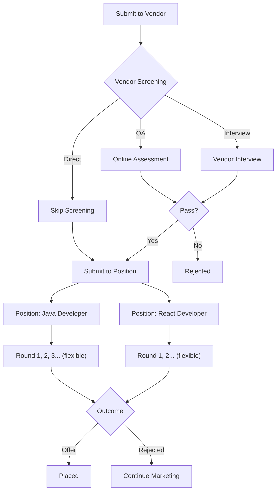

# VicCRM

VicCRM is an internal SaaS for managing software engineer candidates from Recruitment to Placement.

## Project Structure

```
vic_crm/
├── frontend/     # Next.js 16 + TailwindCSS v4
│   └── package.json
├── backend/      # Spring Boot 3.4 + Maven + Java 17
│   └── pom.xml
└── README.md
```

## Getting Started

### Frontend
```bash
cd frontend && npm install && npm run dev
```
Open http://localhost:3000

### Backend
```bash
cd backend && ./mvnw spring-boot:run
```
Server runs on http://localhost:8080

**H2 Console**: http://localhost:8080/h2-console
- JDBC URL: `jdbc:h2:mem:viccrm`
- Username: `sa`
- Password: (empty)

---

## Tech Stack
- **Frontend**: Next.js 16, React 19, TailwindCSS v4
- **Backend**: Spring Boot 3.4, Java 17, H2/PostgreSQL, Maven

---

## API Endpoints

### Users (Recruiters & Admins)
- [x] `GET /api/users` - List all users
- [x] `GET /api/users/{id}` - Get user by ID
- [x] `GET /api/users?role={role}` - Filter users by role (ADMIN, RECRUITER, TRAINER, SUPPORTER, MANAGER)
- [x] `POST /api/users` - Create user
- [x] `PUT /api/users/{id}` - Update user
- [x] `DELETE /api/users/{id}` - Delete user

### Candidates
- [x] `GET /api/candidates` - List all candidates
- [x] `GET /api/candidates/{id}` - Get candidate by ID
- [x] `GET /api/candidates?stage={stage}` - Filter by lifecycle stage
- [x] `POST /api/candidates` - Create candidate
- [x] `PUT /api/candidates/{id}` - Update candidate
- [x] `POST /api/candidates/{id}/transition` - Change lifecycle stage
- [x] `GET /api/candidates/{id}/timeline` - Get candidate timeline events
- [x] `POST /api/candidates/{id}/timeline` - Add custom timeline event

### Batches
- [x] `GET /api/batches` - List all batches
- [x] `GET /api/batches/{id}` - Get batch by ID
- [x] `POST /api/batches` - Create batch
- [x] `PUT /api/batches/{id}` - Update batch
- [x] `DELETE /api/batches/{id}` - Delete batch

### Vendors
- [x] `GET /api/vendors` - List all vendors
- [x] `GET /api/vendors/{id}` - Get vendor by ID
- [x] `POST /api/vendors` - Create vendor (with contacts)
- [x] `PUT /api/vendors/{id}` - Update vendor
- [x] `DELETE /api/vendors/{id}` - Delete vendor

### Clients
- [x] `GET /api/clients` - List all clients
- [x] `GET /api/clients/{id}` - Get client by ID
- [x] `POST /api/clients` - Create client
- [x] `PUT /api/clients/{id}` - Update client
- [x] `DELETE /api/clients/{id}` - Delete client

### Submissions
- [x] `GET /api/submissions` - List all submissions
- [x] `GET /api/submissions/candidate/{id}` - Get submissions by candidate
- [x] `GET /api/submissions/vendor/{id}` - Get submissions by vendor
- [x] `POST /api/submissions` - Create submission
- [x] `PUT /api/submissions/{id}` - Update submission

### Interview Experiences
- [x] `GET /api/interview-experiences` - List all experiences
- [x] `GET /api/interview-experiences/{id}` - Get experience by ID
- [x] `POST /api/interview-experiences` - Create experience
- [x] `PUT /api/interview-experiences/{id}` - Update experience
- [x] `DELETE /api/interview-experiences/{id}` - Delete experience

### Mocks (Mock Interviews)
- [x] `GET /api/mocks` - List all mocks
- [x] `GET /api/mocks/{id}` - Get mock by ID
- [x] `GET /api/mocks/candidate/{id}` - Get mocks by candidate
- [x] `GET /api/mocks/evaluator/{id}` - Get mocks by evaluator
- [x] `POST /api/mocks` - Create mock
- [x] `PUT /api/mocks/{id}` - Update mock (add score/feedback)
- [x] `DELETE /api/mocks/{id}` - Delete mock

---

## Lifecycle Stages

```
RECRUITMENT → TRAINING → MARKET_READY → PLACED
     ↓            ↓            ↓
 ELIMINATED   ELIMINATED   ELIMINATED
```

### Stage Transitions
| From | Allowed To |
|------|------------|
| RECRUITMENT | TRAINING, ELIMINATED |
| TRAINING | MARKET_READY, ELIMINATED |
| MARKET_READY | PLACED, ELIMINATED |
| PLACED | (none) |
| ELIMINATED | (none) |

---

## User Roles

| Role | Description |
|------|-------------|
| ADMIN | System administrator |
| RECRUITER | Candidate sourcing |
| TRAINER | Class training, mock and support |
| SUPPORTER | Candidate mock and support |
| MANAGER | Management oversight |

---

## Features

### Candidate Management
- **Add Candidate Form**: Create candidates with recruiter and batch assignment
- **Career Timeline**: Track all events from recruitment to placement
- **Stage Transitions**: Move candidates through RECRUITMENT → TRAINING → MARKET_READY → PLACED
- **Submissions Tab**: Submit candidates to vendors with client and contact selection

### Batch Management
- **Batch Detail Page**: View batch info, stats, and assigned candidates
- **Sourcing Performance**: Track recruiter sourcing stats (sourced, ready, placed)
- **Stage Statistics**: See counts for training, market ready, and placed candidates

### Vendor Management
- **Vendor List**: Track vendors with company name, contact, email, phone
- **Vendor Contacts**: Add multiple contacts per vendor with name, email, phone, LinkedIn, notes
- **Vendor-Client Links**: Associate vendors with the clients they work with
- **Vendor Detail Page**: View vendor performance metrics and submission history
- **Performance by Contact**: Track individual contact success rates (placed, offered, rejected)

### Client Management
- **Client List**: Track end clients with company name and industry
- **Submission Flow**: Track candidate submissions to client positions

### Submissions

#### Submission Flow



- **Candidate Submissions**: Submit candidates to vendors with position, client, and contact
- **Status Tracking**: VENDOR_SCREENING → CLIENT_ROUND → OFFERED/PLACED/REJECTED
- **Round Tracking**: Track interview round progression
- **Contact Attribution**: Track which vendor contact handled each submission

### Interview Experience (面经)
- **Tech Categories**: Filter by Java, React, Python, AWS, etc.
- **Recording Links**: Store interview recording URLs
- **Tech Tags**: Tag specific technologies covered in interviews

### Timeline Event Types
| Type | Description |
|------|-------------|
| STAGE_CHANGE | Automatic stage transitions |
| COMMUNICATION | Talked, scheduled screening |
| CONTRACT | Contract sent/signed |
| BATCH | Batch started/ended |
| READINESS | Resume ready |
| MOCK | Tech mock, general mock |
| VENDOR_SUBMIT | Submitted to vendor |
| VENDOR_OA | Vendor online assessment |
| VENDOR_INTERVIEW | Vendor interview |
| CLIENT_SUBMIT | Submitted to client |
| CLIENT_INTERVIEW | Client interview round |
| OUTCOME | Offer, placed |
| CLOSED | Closed with reason |

---

## Data Models

### VendorContact (Embeddable)
| Field | Type | Description |
|-------|------|-------------|
| name | String | Contact name (required) |
| email | String | Contact email |
| phone | String | Contact phone |
| linkedinUrl | String | LinkedIn profile URL |
| notes | String | Notes about contact |

### Submission
| Field | Type | Description |
|-------|------|-------------|
| candidate | Candidate | The candidate being submitted |
| vendor | Vendor | The vendor receiving submission |
| client | Client | Target client (optional) |
| vendorContact | String | Name of vendor contact |
| positionTitle | String | Job position title |
| status | Enum | VENDOR_SCREENING, CLIENT_ROUND, OFFERED, PLACED, REJECTED |
| screeningType | Enum | OA, INTERVIEW, DIRECT |
| currentRound | Integer | Interview round number |
